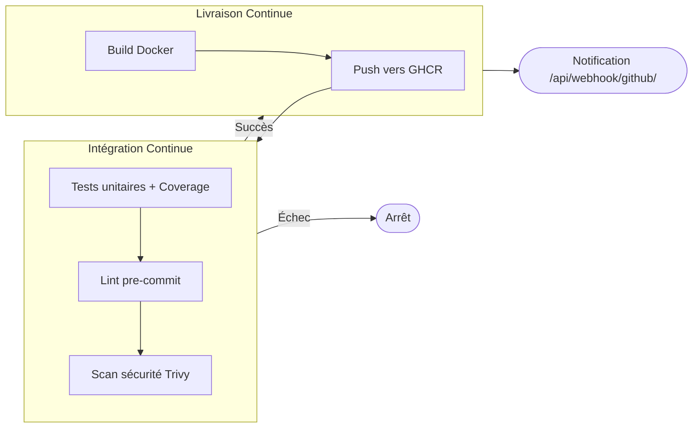

# Messagerie DevOps


Application de messagerie avec pipeline CI/CD complet — démonstration technique DevOps (Master 2, Architecture Logicielle).

---

## Stack Technique

| Couche | Technologie |
|---|---|
| **Backend** | Django 6.0.4, DRF 3.16, Gunicorn |
| **Base de données** | PostgreSQL 15 (Render Managed) |
| **Frontend** | HTML5, CSS3 (variables CSS), Chart.js, FontAwesome |
| **API** | REST (JSON) + Swagger/OpenAPI |
| **Conteneurisation** | Docker multi-stage, Docker Compose |
| **CI/CD** | GitHub Actions → GHCR |
| **Tests** | unittest, coverage.py (seuil ≥70%) |
| **Qualité** | pre-commit hooks |
| **Sécurité** | Trivy scanner (HIGH/CRITICAL) |
| **Dépendances** | Dependabot (pip, docker, actions) |
| **Logs** | Logging Python structuré (console) |

---

## Pipeline CI/CD

### Workflow complet (`.github/workflows/ci.yml`)



### Jobs détaillés

| Job | Déclencheur | Description |
|---|---|---|
| `tests` | push, PR | Tests Django + coverage ≥70% + seed data + health check |
| `lint` | push, PR | pre-commit (trailing-whitespace, YAML, JSON, secrets, debug) |
| `security` | push, PR | Trivy scan image Docker (HIGH/CRITICAL → échec) |
| `build-and-push` | push main uniquement | Build + push vers `ghcr.io` |

Le CD ne démarre qu'après le succès des 3 jobs CI.

---

## Qualité du code

### Pre-commit hooks

```bash
pip install pre-commit
pre-commit install     # installe les hooks git
pre-commit run --all-files   # vérification manuelle
```

Hooks activés : trailing-whitespace, end-of-file-fixer, check-yaml, check-json, check-added-large-files, check-merge-conflict, detect-private-key, debug-statements.

### Dependabot

`.github/dependabot.yml` — mises à jour automatiques chaque lundi pour :
- pip (dépendances Python, max 5 PRs)
- Docker (image de base, max 3 PRs)
- GitHub Actions (max 3 PRs)

---

## Sécurité

### Trivy (image Docker)

Scanné à chaque push/PR via `aquasecurity/trivy-action` :
- Vulnérabilités OS + librairies Python
- Seuil bloquant : HIGH et CRITICAL
- Rapport SARIF uploadé dans GitHub Security tab

### Configuration Django (production)

| Setting | Valeur |
|---|---|
| `SECURE_HSTS_SECONDS` | 31536000 |
| `SECURE_SSL_REDIRECT` | True |
| `SESSION_COOKIE_SECURE` | True |
| `CSRF_COOKIE_SECURE` | True |

### Gestion d'erreurs

- Handler 400/403/404/500 avec logs détaillés (path, user, method)
- Templates d'erreur personnalisés (400.html, 403.html, 404.html, 500.html)
- Login/Logout avec logging (tentatives échouées, succès)

---

## Health Check

```json
GET /health/
{
  "status": "ok",
  "version": "a1b2c3d",
  "db": { "status": "ok" }
}
```

- Retourne 200 si DB OK, 503 en mode dégradé
- Logs détaillés à chaque appel
- `version` = commit Render (ou "dev" en local)

---

## Démarrer en local

```bash
cp .env.example .env
docker compose up --build
```

Accès : `http://localhost:8000`

---

## Tests

```bash
docker compose run --rm web python manage.py test

# Avec couverture
docker compose run --rm web sh -c "\
  coverage run --source=mymessages manage.py test && \
  coverage report"

# Seed data
docker compose run --rm web python seed_data.py
```

**34 tests — 94% coverage.**

---

## API REST

| Méthode | Endpoint | Auth | Description |
|---|---|---|---|
| GET | `/api/messages/` | Oui | Liste paginée |
| POST | `/api/messages/` | Oui | Créer un message |
| GET | `/api/messages/{id}/` | Oui | Détail |
| PUT/PATCH | `/api/messages/{id}/` | Oui | Modifier |
| DELETE | `/api/messages/{id}/` | Oui | Supprimer |
| GET | `/api/schema/` | Oui | OpenAPI Schema |
| GET | `/api/docs/` | Oui | Swagger UI |

### Webhook GitHub

| Méthode | Endpoint | Description |
|---|---|---|
| POST | `/api/webhook/github/` | Réception webhooks GitHub (HMAC signé) |
| GET | `/api/webhook/github/` | Info (health check webhook) |

---

## Fonctionnalités

### Core
- CRUD messages avec permissions granulaire
- Inscription utilisateur
- Read/Unread — marquage automatique + badge notification
- Reply/Thread — système de réponse parent/child
- Recherche full-text
- Dashboard admin avec graphiques Chart.js
- Pagination AJAX "Voir plus"

### Import/Export
- Import CSV avec validation
- Export PDF messages personnels + rapport statistique

### UX
- Dark mode persisté (localStorage)
- Design responsive
- Notification email via signal post_save

---

## Roadmap

- [x] Bugfixes (sender→owner, templates, i18n)
- [x] Inscription utilisateur
- [x] Read/Unread + badge notification
- [x] Reply/thread system
- [x] REST API + Swagger
- [x] Dark mode
- [x] Email notification (signal)
- [x] Throttling + Pagination
- [x] Tests coverage ≥70%
- [x] AJAX pagination (Load more)
- [x] CI/CD pipeline (tests → lint → security → build → push)
- [x] Pre-commit hooks
- [x] Dependabot (dépendances)
- [x] Health check enrichi
- [x] Scan sécurité Docker (Trivy)
- [x] Logging applicatif complet
- [x] Gestion d'erreurs (400/403/404/500)
