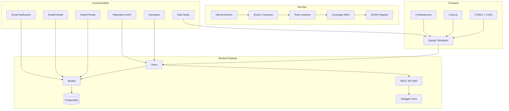
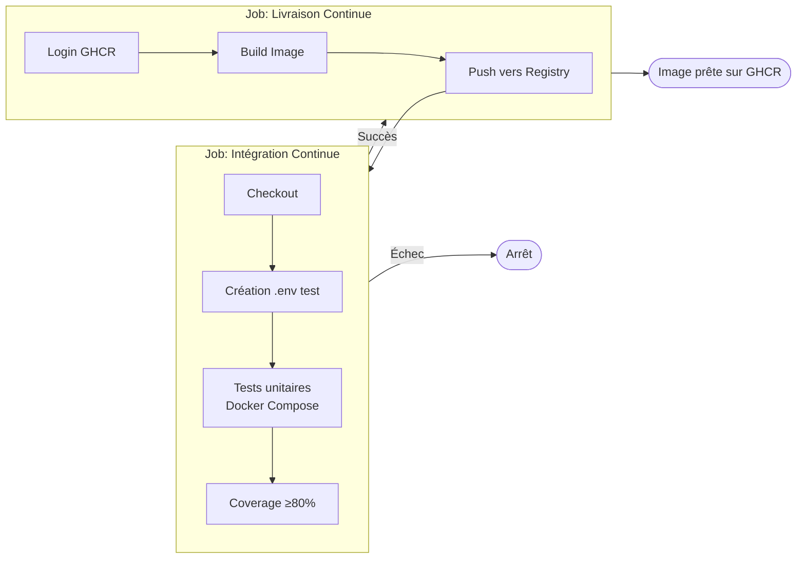

# Messagerie DevOps


Application de messagerie avec pipeline CI/CD complet — démonstration technique DevOps (Master 2, Architecture Logicielle).

---

## Architecture



---

## Stack Technique

| Couche | Technologie |
|---|---|
| **Backend** | Django 6.0, DRF 3.16, Gunicorn |
| **Base de données** | PostgreSQL 15 |
| **Frontend** | HTML5, CSS3 (variables CSS), Chart.js, FontAwesome |
| **API** | REST (JSON) + Swagger/OpenAPI |
| **Conteneurisation** | Docker, Docker Compose |
| **CI/CD** | GitHub Actions → GHCR |
| **Tests** | unittest, coverage.py (seuil ≥80%) |

---

## Fonctionnalités

### Core
- **CRUD** messages avec permissions granulaire (`add_message`, `change_message`, `delete_message`)
- **Inscription** utilisateur via formulaire dédié
- **Read/Unread** — marquage automatique à la lecture + badge notification
- **Reply/Thread** — système de réponse avec parent/child
- **Recherche** full-text dans la liste des messages
- **Dashboard** admin avec graphiques Chart.js (activité par jour, répartition par utilisateur)
- **Pagination AJAX** bouton "Voir plus" sans rechargement

### Import/Export
- **Import CSV** — upload en masse avec validation des utilisateurs
- **Export PDF** — messages personnels + rapport statistique

### API REST
- Endpoint `/api/messages/` avec authentication session/Basic
- Pagination, filtrage, throttling (100/h user, 20/h anon)
- Documentation Swagger sur `/api/docs/`

### UX
- **Dark mode** persisté dans localStorage avec toggle
- **Design responsive** sidebar adaptative
- **Notifications email** via signal `post_save`

---

## Pipeline CI/CD

### Workflow (`.github/workflows/ci.yml`)



- **CI** : `docker compose run --build --rm web python manage.py test` + `coverage run --fail-under=80`
- **CD** : Build & push vers `ghcr.io/<repo>` (nécessite `integration-continue`)

---

## Sécurité

| Setting | Défaut | Prod (via env) |
|---|---|---|
| `SECURE_HSTS_SECONDS` | 0 | 31536000 |
| `SECURE_SSL_REDIRECT` | False | True |
| `SESSION_COOKIE_SECURE` | False | True |
| `CSRF_COOKIE_SECURE` | False | True |

---

## Démarrer en local

```bash
# 1. Cloner
git clone <repo-url> && cd <repo>

# 2. Config
cp .env.example .env

# 3. Lancer
docker compose up --build
```

Accès : `http://localhost:8000`  
Admin : `python manage.py createsuperuser`

---

## Tests

```bash
docker compose run --rm web python manage.py test

# Avec couverture
docker compose run --rm web sh -c "coverage run --source='mymessages' manage.py test && coverage report"
```

**34 tests — 94% coverage** (core business logic 100%).

---

## API

| Méthode | Endpoint | Auth | Description |
|---|---|---|---|
| GET | `/api/messages/` | Oui | Liste paginée |
| POST | `/api/messages/` | Oui | Créer un message |
| GET | `/api/messages/{id}/` | Oui | Détail |
| PUT/PATCH | `/api/messages/{id}/` | Oui | Modifier |
| DELETE | `/api/messages/{id}/` | Oui | Supprimer |
| GET | `/api/schema/` | Oui | OpenAPI Schema |
| GET | `/api/docs/` | Oui | Swagger UI |

---

## Roadmap

- [x] Bugfixes (sender→owner, templates, i18n)
- [x] Inscription utilisateur
- [x] Read/Unread + badge notification
- [x] Reply/thread system
- [x] REST API + Swagger
- [x] Dark mode
- [x] Email notification (signal)
- [x] Throttling + Pagination
- [x] Tests coverage ≥80%
- [x] AJAX pagination (Load more)
- [ ] CI/CD déploiement automatique Render
